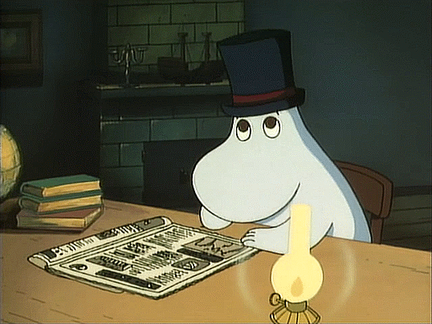
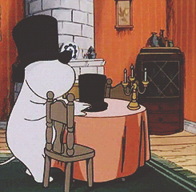
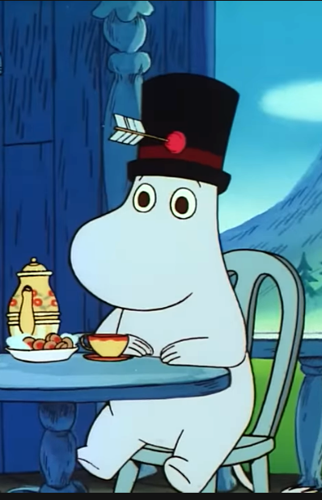

  
  
  
  
  

###

<h1 align="center">Hullo!👋 I'm Band2 and I create programs because of my fear of being unproductive! (I hate myself)</h1>

###

<h3 align="left">👩‍💻  About Me</h3>

###

I'm a college student and I struggling fitting in

###

  
  

###
